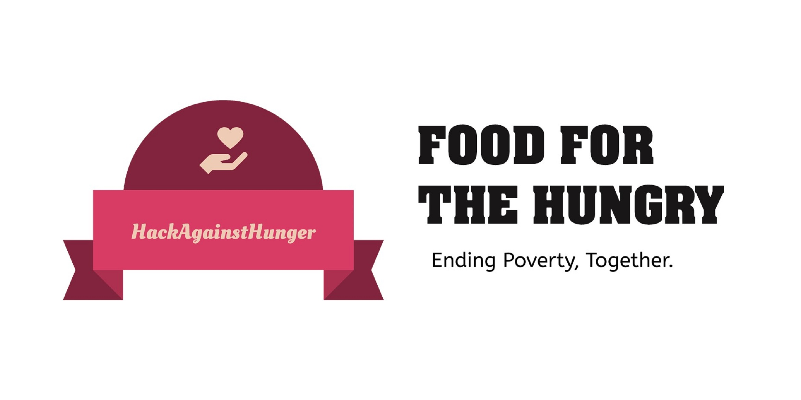

## HungerHackers prototype submission

### 1. Team name 
HungerHackers

### 2. Team members name 

   1. Harshith Kanigalpula
   2. Yamini Haripriya K
   3. Simran Anand
   4. Gudi Varaprasad

### 3. Name of project

   Hack against Hunger

### 4. One liner for project

   End hunger, achieve food security & improved nutrition and promote sustainable development

### 5. Which sdg does your project align with? 

   Sustainable Development Goal 2: Zero Hunger

### 6. Write a short description of your project.  

The organization aims at satisfying the requirements to feed people through donations over the internet. The application shall ask the user/donor to register his/her details into the website and then he/she can log in and donate, contribute, and help financially. Similarly, people can register on the website and then attend the events, donate food, money. Also, a donor can view the list of items put up by seekers and can donate the same, if possible. In the same way, donors can contribute the donated item by contacting our organization. The application is developed using web services.

### 7. What does your project solve? 

The main objectives of the proposed application include a reduction in wastage of food, eradicate hunger, educate people, and making food available to orphanages, old-age homes, and other such organizations, which will also inculcate values of sharing and sensitivity among people.

### 8. Challenges you ran into during the hackathon.  

   1. Very limited time to plan, develop and test your product.
   2. A lot of research about the theme/topic.
   3. Unclear Problem Statements initially.

### 9. Technologies used for the project 

  | Technology used | Description and uses |
  | --- | --- |
  | HTML 5 | Appearance of website |
  | CSS 3 | Adding style and presentation to the web-pages  |
  | JavaScript | Adding interactive user behavior to web pages |
  | Bootstrap v4.0 | front-end framework used for UI |
  | PHP | Server side programming and interactive with phpMyAdmin |
  | MySQL | For the purpose of a web database and logging application |
  | phpMyAdmin | Management of databases, tables, indexes, permissions |
  | GITHUB | Web-based platform used for working with our Team; Team collaboration |
  | Net beans IDE | Enables accelerated HTML 5 Web application development |
  

### 10. Link for Video / ppt showing how the prototype works ( be as creative and innovative as possible ).  

[Click here ---> Link to Prototype](https://drive.google.com/drive/folders/16jEGES1HQ_davW9gM1JzvR3zj3rcMF1q?usp=sharing)
